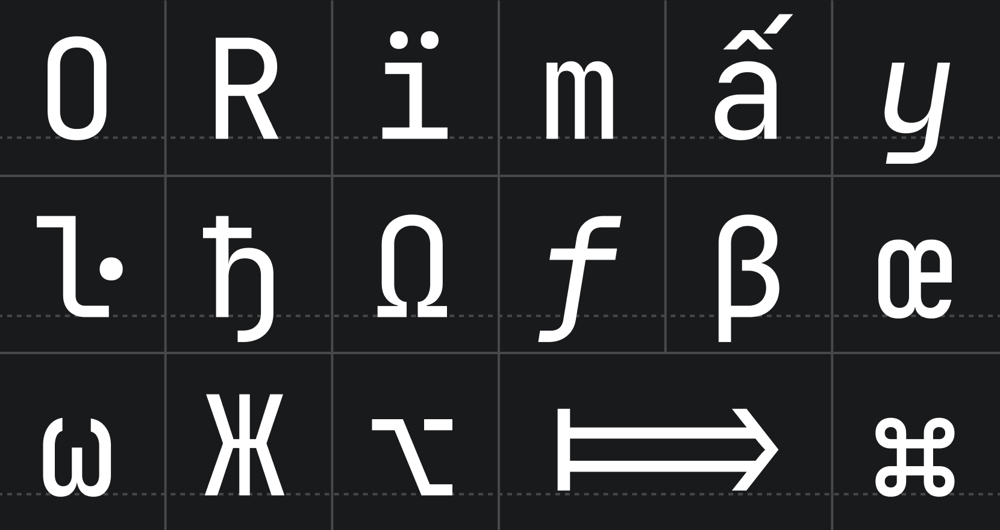
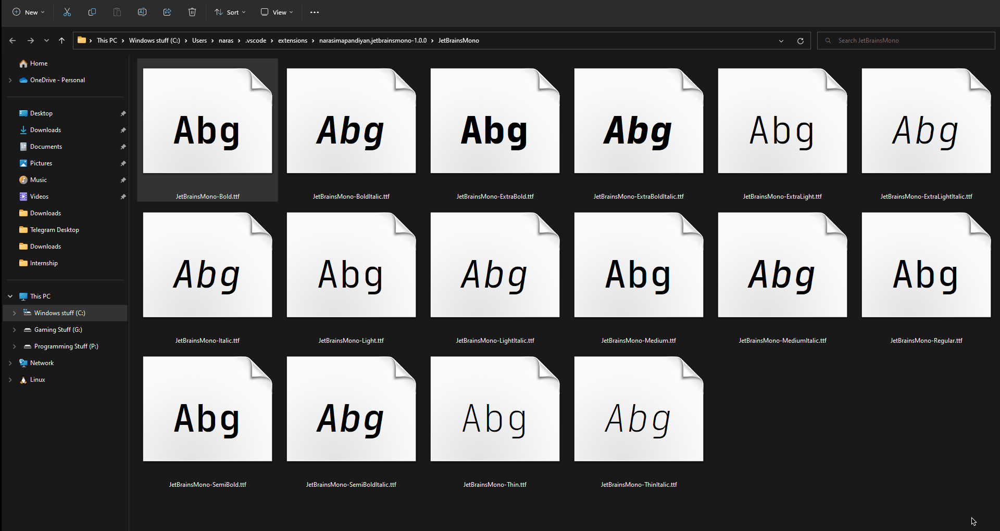
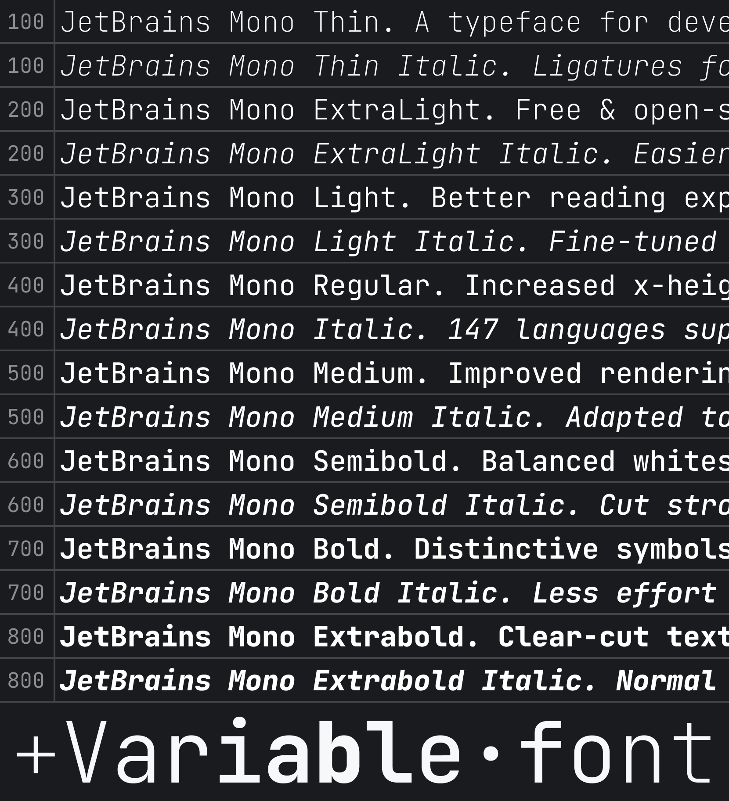
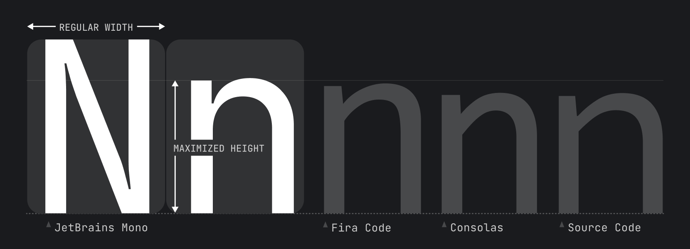
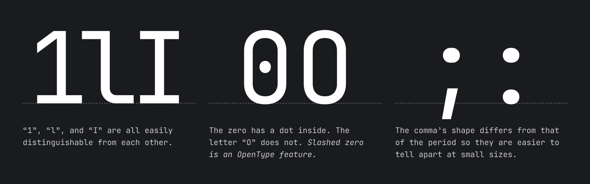
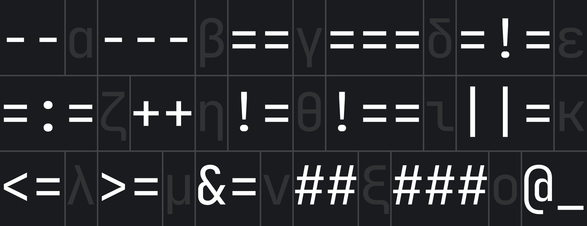
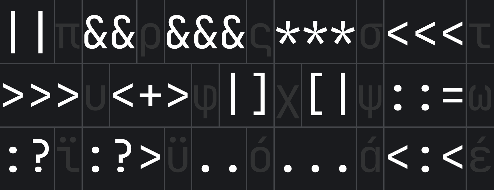
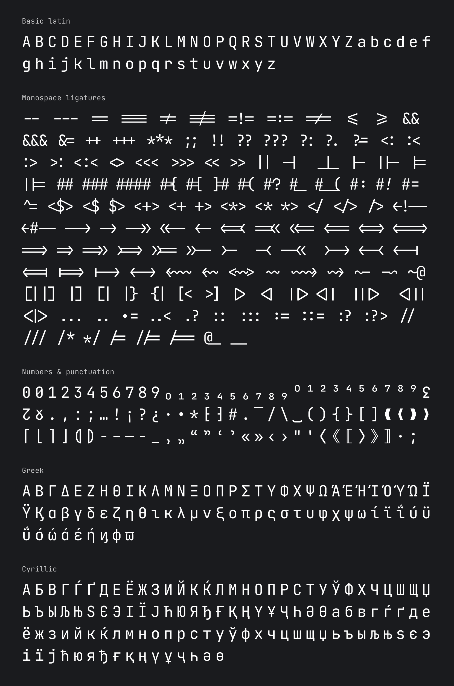

 

# JetBrains Mono: a typeface made for developers

JetBrains Mono is available as a standalone download, and is also bundled in all JetBrains IDEs. Discover more font features & design on its [web page](https://jetbrains.com/mono/).

# How to install

#### Install font:

When the **Font Directory** appears, install fonts if you haven't already, and restart VSCODE once you have.

**Note:** this is because of `OS` limitations, the fonts must be installed manually.

### Available Commands

- `Activate JetBrains Mono Font pack`
- `Deactivate JetBrains Mono Font`

# Font Styles

There are 8 font styles available in JetBrains Mono, from Thin to ExtraBold, each coming with its own _italic_ version.

## Font Features

### Increased x-height

While characters remain standard in width, the height of the lowercase is maximized. This approach keeps code lines to the length that developers expect, and it helps improve rendering in small size, since each symbol occupies more pixels.

### Distinctiveness of symbols

## Ligatures for Code

A ligature is a character consisting of two or more joined symbols. Traditionally, it was introduced as a space-saving technique in printed texts. In code, this technique is adopted to show operators and is used mainly for two purposes:

1. To **reduce noise** by merging symbols and removing details so the eyes are processing less:

2. To balance whitespace more efficiently by shifting the glyphs in certain cases:

📝 Note: if your IDE doesn’t support OpenType features and ligatures, use [JetBrains Mono NL](https://github.com/JetBrains/JetBrainsMono/tree/master/fonts/ttf) instead.

## Basic Character Set

You can find full JetBrains Mono character set on official [wiki page](https://github.com/JetBrains/JetBrainsMono/wiki/List-of-supported-symbols).

## Not your type?

Check out - [FiraCode](https://marketplace.visualstudio.com/items?itemName=SeyyedKhandon.firacode) Font Pack
